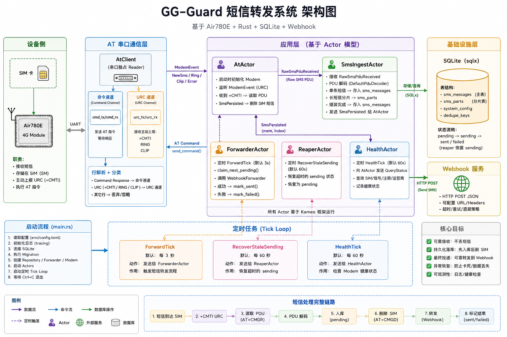
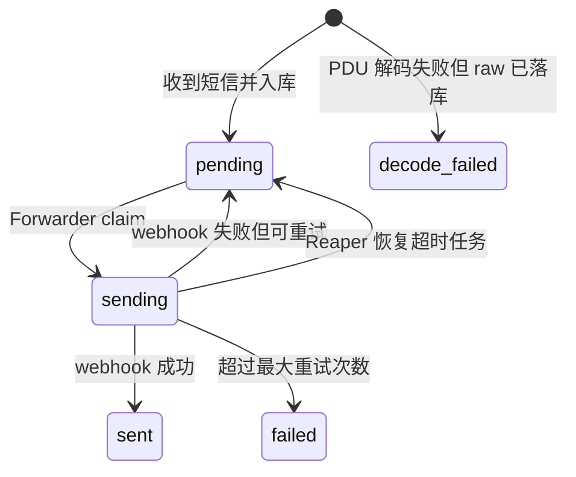

基于 **Air780E + Rust + SQLite + Webhook** 的短信自动转发守护进程。

它可以监听 4G 模块收到的新短信，将短信读取出来并持久化到本地 SQLite，然后自动转发到指定 Webhook。适合保号短信、验证码接收、通知转发、低成本短信网关等场景。

## 架构图



## 工作流程



## 核心特性

- Air780E AT 指令通信
- PDU 模式短信读取
- 支持中文短信 UCS2 解码
- 支持长短信 multipart 组装
- SQLite 本地持久化队列
- Webhook 自动转发
- 失败重试与卡死任务恢复
- 低 CPU 占用，适合树莓派长期运行

## 运行

```bash
GG_GUARD_MODEM_PORT=/dev/ttyACM0 \
GG_GUARD_WEBHOOK_URL=http://127.0.0.1:8082/sms \
GG_GUARD_DATABASE_URL=sqlite:///tmp/gg-guard/sms.db?mode=rwc \
RUST_LOG=info,sqlx=warn \
./gg-guard
```

## 构建

```bash
cargo build --release
```

生成文件：

```text
target/release/gg-guard
```

## 配置

常用环境变量：

| 变量                    | 说明              | 示例                                     |
| ----------------------- | ----------------- | ---------------------------------------- |
| `GG_GUARD_MODEM_PORT`   | AT 串口路径       | `/dev/ttyACM0`                           |
| `GG_GUARD_WEBHOOK_URL`  | 短信转发 Webhook  | `http://127.0.0.1:8082/sms`              |
| `GG_GUARD_DATABASE_URL` | SQLite 数据库地址 | `sqlite:///tmp/gg-guard/sms.db?mode=rwc` |
| `RUST_LOG`              | 日志级别          | `info,sqlx=warn`                         |

## 组件说明

| 组件             | 作用                                      |
| ---------------- | ----------------------------------------- |
| `AtClient`       | 独占串口，发送 AT 指令，接收 URC          |
| `AtActor`        | 初始化模块，监听新短信事件，读取/删除短信 |
| `SmsIngestActor` | 解码 PDU，保存短信，组装长短信            |
| `ForwarderActor` | 从 SQLite 拉取待转发短信并调用 Webhook    |
| `ReaperActor`    | 恢复卡住的 sending 任务                   |
| `HealthActor`    | 定期检查 SIM、信号和注册状态              |

## 可靠性设计

短信处理采用：

```text
先入库 -> 再删除 SIM -> 再异步转发
```

这样即使 Webhook 暂时失败，短信也不会丢失，而是保存在 SQLite 中等待重试。

## 调试

开发调试可以打开项目 debug 日志：

```bash
RUST_LOG=info,sqlx=warn,gg_guard=debug ./gg-guard
```

生产环境建议使用：

```bash
RUST_LOG=info,sqlx=warn
```

避免 AT 原始日志过多。

## 注意事项

- Linux 下需要确保当前用户有串口权限。
- 如遇串口被占用，可关闭 `ModemManager`。
- `AT+CLIP=1` 如果返回 `ERROR`，通常不影响短信接收。
- 长短信只有所有分片到齐后才会转发。
